## **Education**
---

##### **University of Texas at Austin**

*Ph.D. in Computer Science, advised by Prof. [Philipp Krähenbühl](https://www.philkr.net/)*
 
*Aug. 2025 - Present*

##### **National Tsing Hua University**

*M.S. in Computer Science, advised by Prof. [Chun-Yi Lee](https://scholar.google.com/citations?user=5mYNdo0AAAAJ&hl=en)*
 
*Sep. 2022 - Jul. 2025*

*B.S. in Interdisciplinary program of Electrical Engineering and Computer Science (EECS)*
 
*Sep. 2018 - Jun. 2022*

 

## **Misc**
---

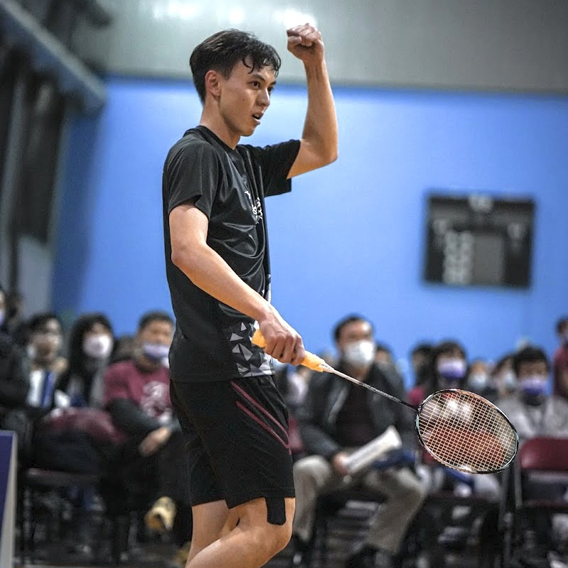 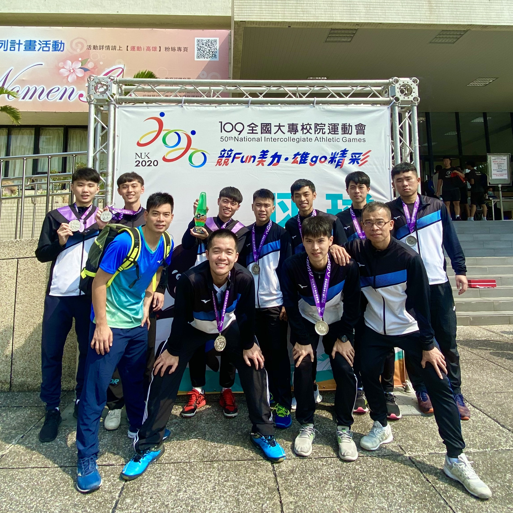 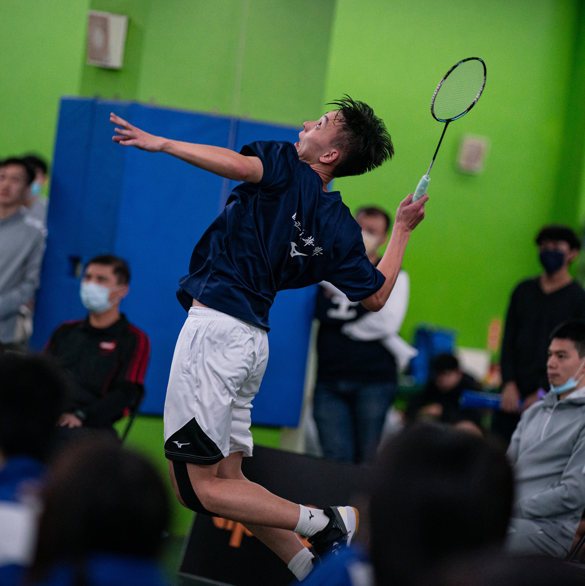

<!-- 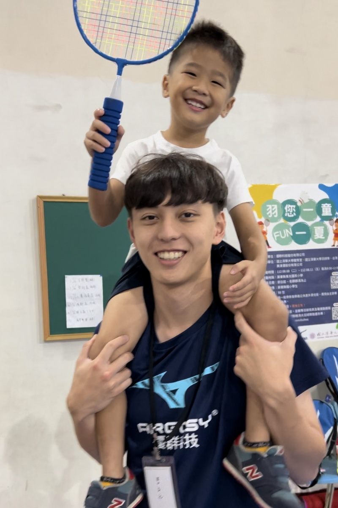 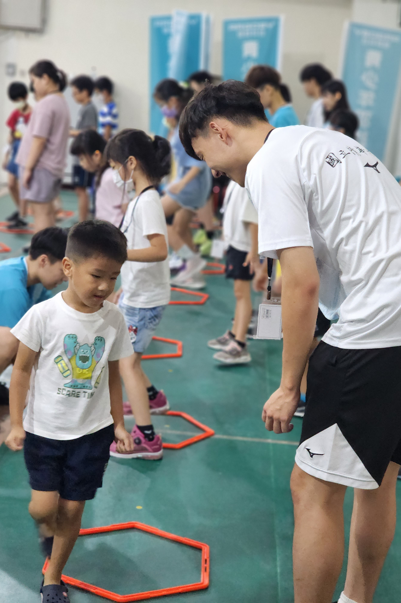 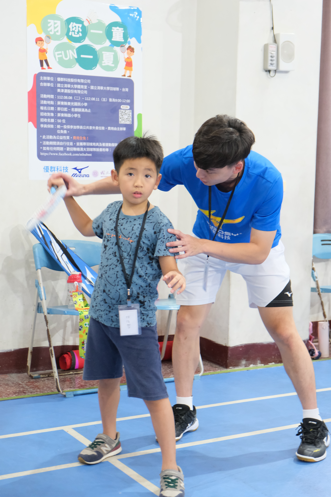 -->

 

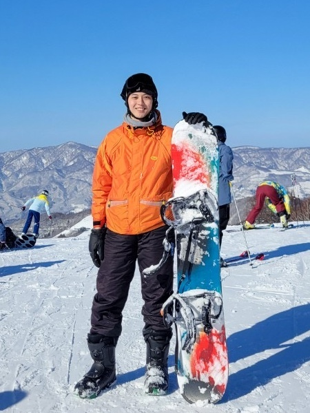 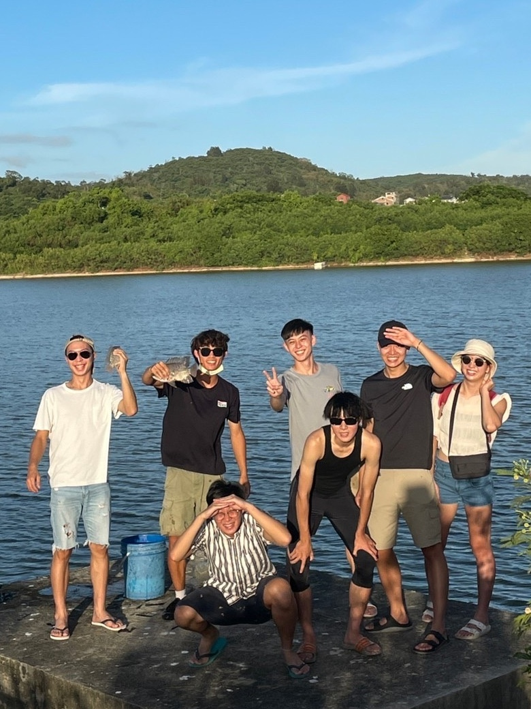 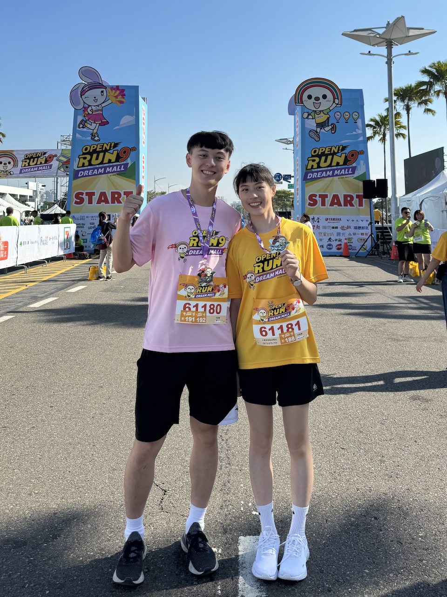
  
<!-- 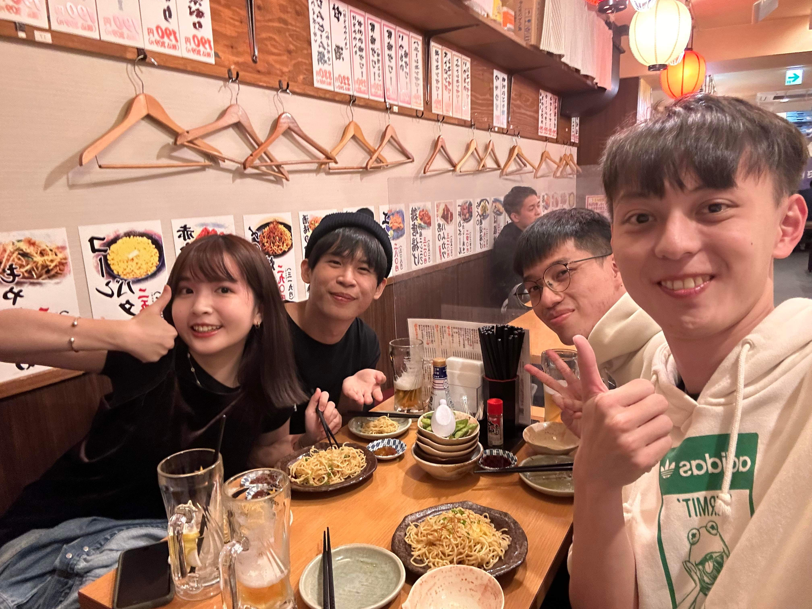 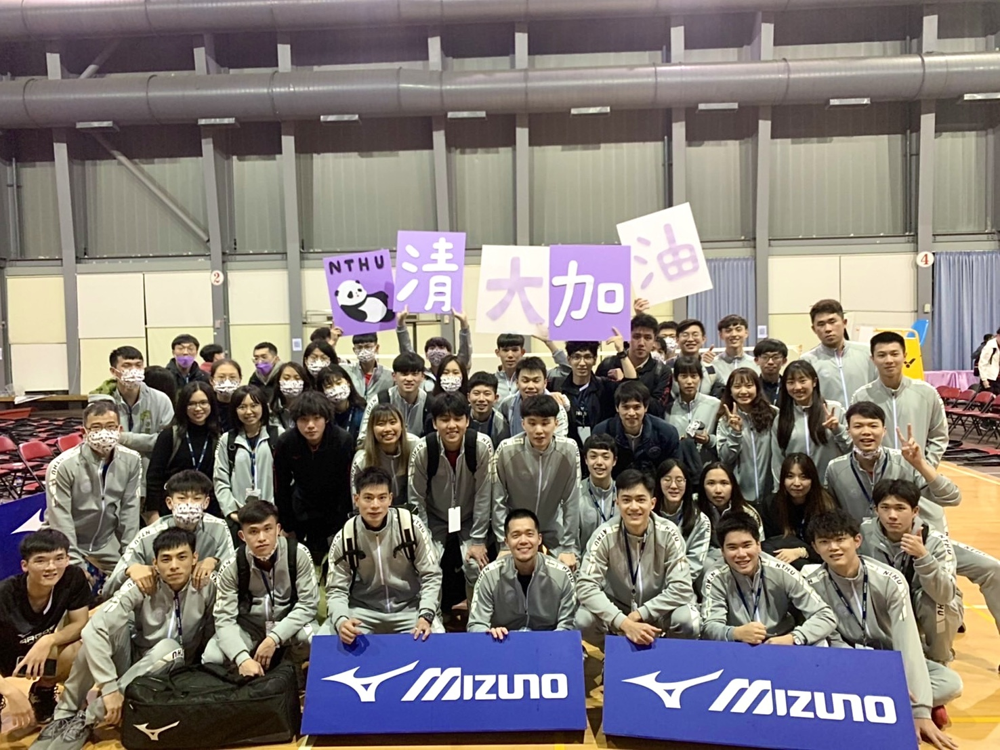 -->
<!--    -->
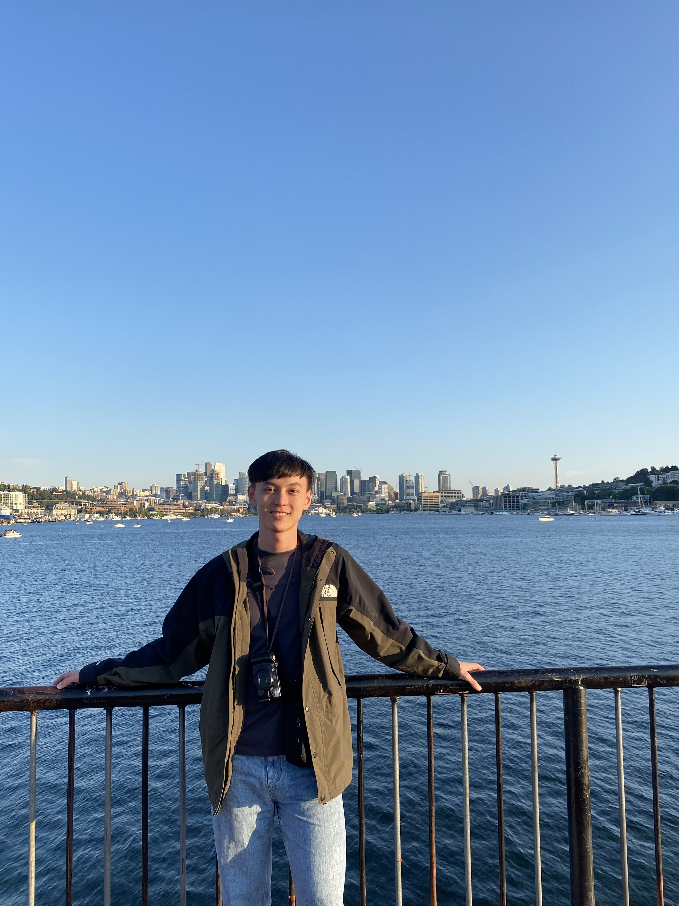 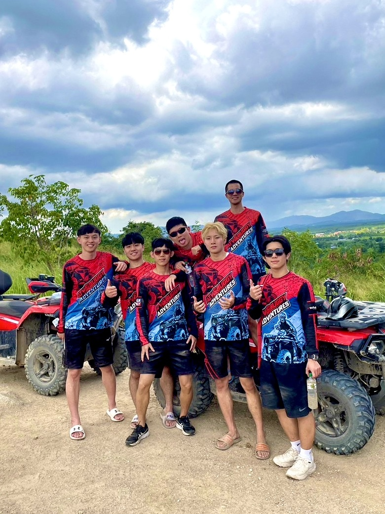 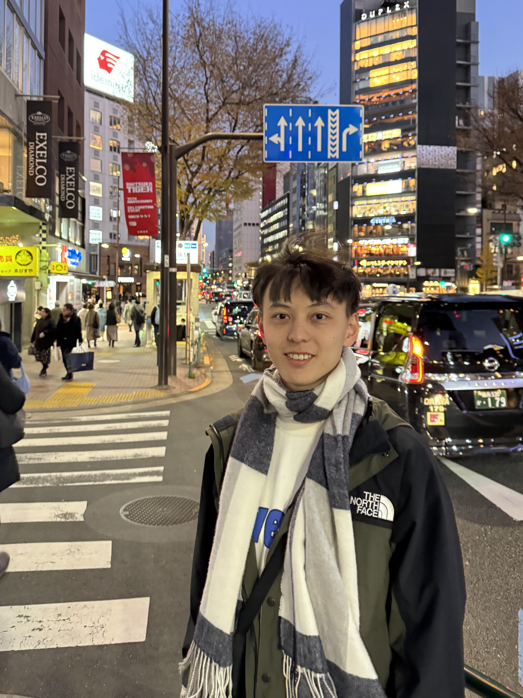