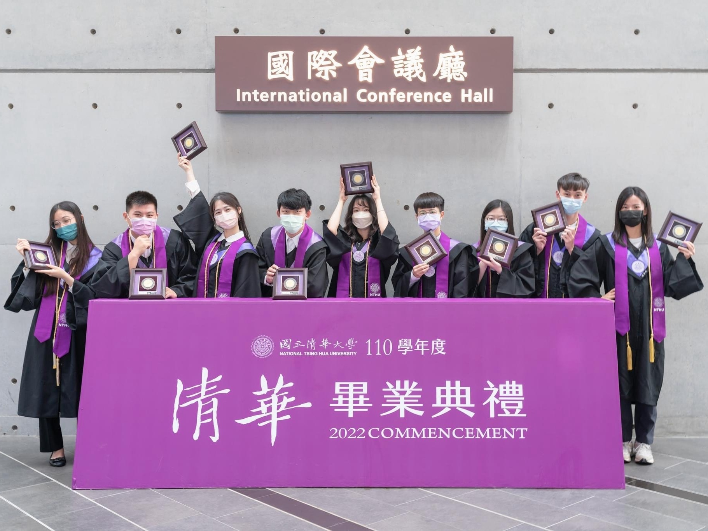
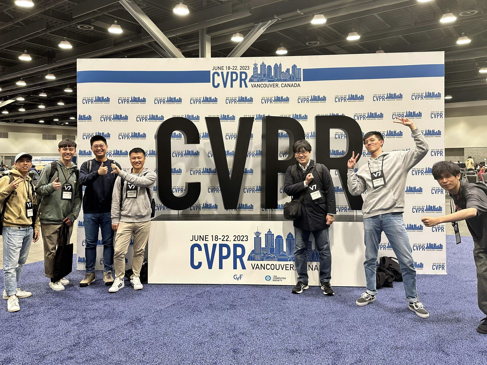
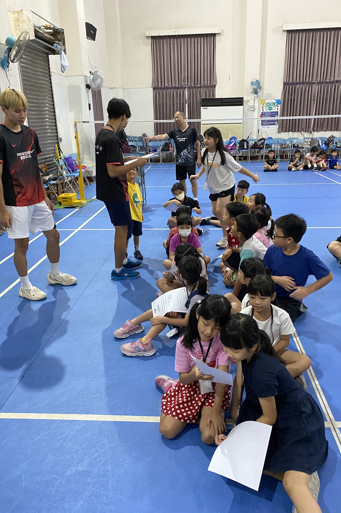

## **Experinces**

---

##### **AI Research Intern @ [Mediatek Inc.](https://www.mediatek.tw/)** 

*Jan, 2022 - Jan, 2023*
* Develop deep learning-based computer vision algorithms. (Main topic: Image Super-Resolution)
    * **One research paper accepted by CVPR 2023 during the internship.**

---

##### **Captain of Badminton Team @ [NTHU Badminton Team](https://www.facebook.com/nthubmt)**

*Nov, 2020 - Oct, 2021*
* **Led a team over 60 members**, including undergraduate and graduate students.
* Selected Award: National Intercollegiate Athletic Games of badminton, 2nd place.

  

Photo Credit: [@stwu5](https://www.instagram.com/stwu5/)

  

## **Awards & Scholarships**

---

<!-- Conference Scholarships -->

    

        <strong>Conference Scholarships</strong>, <i>Apr-May, 2023</i>
            <ul><li> First author scholarship from
            <a href="https://buildyourfuture.withgoogle.com/scholarships/google-conference-scholarships">Google</a>, <a href="https://www.appier.com/zh-tw/scholarship">Appier</a>, <a href="https://icdesign.mediatek.com/PageScholarshipDetails?id=4">MediaTek</a>, and <a href="https://www.nstc.gov.tw/">NSTC</a>.
            </li></ul>
    

    <!-- 
<i>Apr-May, 2023</i>
 -->

<!-- Xing Jian Award -->

    

        <strong>Xing Jian Award</strong>, <i>Apr, 2023</i>
            <ul><li>
            Awarded for outstanding and diverse accomplishments in fields beyond academia. <a href="https://dsa.site.nthu.edu.tw/p/404-1266-196514.php?Lang=zh-tw">[Link]</a>
            </li></ul>
    

    <!-- 
<i>Apr, 2023</i>
 -->

<!-- Nurturing Outstanding Talents Scholarship -->

    

        <strong>Nurturing Outstanding Talents Scholarship</strong>, <i>Oct, 2022</i>
            <ul><li>
                Selected by <i><a href="https://www.esunbank.com/en/personal">E.SUN Commercial Bank</a></i> as <b><u>one of only 5 national awardees</u></b> in the engineering and science category. <a href="https://www.esunfhc.com/zh-tw/Foundation/volunteer/Scholarship/Scholarship-Plan">[Link]</a>
            </li></ul>
    

    <!-- 
<i>Oct, 2022</i>
 -->

<!-- Dr. Mei Yi-Chi Memorial Prize -->

    

        <strong>Dr. Mei Yi-Chi Memorial Prize</strong>, <i>May, 2022</i>
            <ul><li>
            <b><u>The highest honor of newly graduates</u></b> at NTHU, awarded to a maximum of 10 candidates annually. <a href="https://dsa.site.nthu.edu.tw/p/404-1266-142677.php?Lang=en">[Link]</a>
            </li></ul>
    

    <!-- 
<i>May, 2022</i>
 -->

<!-- Pan Wen Yuan Foundation Scholarship -->

    

        <strong>Pan Wen Yuan Foundation Scholarship</strong>, <i>May, 2022</i>
            <ul><li>
                Awarded to the <b><u>top 1%</u></b> students at the College of EECS. <a href="https://pan.itri.org.tw/awards/scholarship.aspx?nid=F1F97516C31E9D90">[Link]</a>
            </li></ul>
    

    <!-- 
<i>May, 2022</i>
 -->

 

  

## **Services**

---
<!-- Badminton Charity Teaching Program -->

    

        <strong>Badminton Charity Teaching Program</strong>, <i>Aug, 2023</i>
            <ul>
                <li>Conducted one-week-long badminton charity teaching sessions in remote areas.</li>
                <li>Served as <b><u>coach and group leader</u></b>, coordinating training schedules and mentoring
young participants.</li>
            </ul>
    

    <!-- 
<i>Aug, 2023</i>
 -->

 

<!-- Teaching Assistant -->

    

        <strong>Teaching Assistant</strong>, <i>Feb, 2021 - Jun, 2021</i>
            <ul><li>
                Course: <i>Probability (EECS303001)</i>
            </li></ul>
    

    <!-- 
<i>Feb, 2021 - Jun, 2021</i>
 -->

<!-- International Conference Reviewer -->

    

        <strong>International Conference Reviewer</strong>
            <ul><li>
                Served as a reviewer of <i>NeurIPS</i>, <i>CVPR</i>, <i>ICML</i>.
            </li></ul>
    

